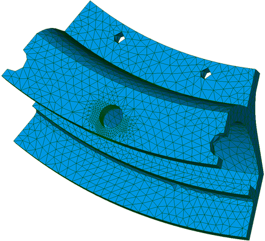
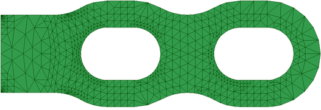
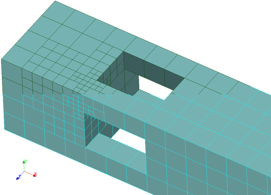
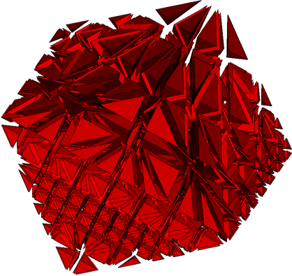
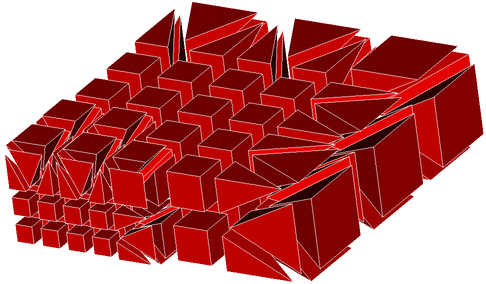

Introduction
============
Le logiciel HOMARD est destiné à adapter les maillages dans le cadre des codes de calculs par éléments ou volumes finis. Ce logiciel, réalisé par EDF R&D, procède par raffinement et déraffinement des maillages bidimensionnels ou tridimensionnels. Il est conçu pour être utilisé indépendamment du code de calcul auquel il est couplé.

HOMARD sait traiter des maillages en 2 ou 3 dimensions et comportant les mailles suivantes :
   - mailles-points
   - segments
   - triangles
   - quadrangles
   - tétraèdres
   - hexaèdres
   - prismes

Ces mailles peuvent être présentes simultanément. Par exemple, HOMARD saura adapter un maillage comportant des triangles et des quadrangles.
Les noeuds acceptés sont évidemment les noeuds qui sont les sommets des mailles, ce qui correspond à la description classique « en degré 1 » . Si les éléments sont décrits « en degré 2 », les noeuds complémentaires sont gérés. En revanche, il ne peut pas y avoir cohabitation de mailles décrites en degré 1 et d'autres décrites en degré 2. Enfin, HOMARD sait prendre en compte des noeuds isolés, qui n'appartiendraient à aucune définition de mailles : ils ressortiront tels quels du processus d'adaptation.

Le cas des pyramides est à part. HOMARD produit des pyramides pour assurer la conformité du raffinement de maillages formés d'hexaèdres ou de prismes. En revanche, HOMARD n'adapte pas un maillage qui contiendrait des pyramides au départ, sauf cas particuliers (voir :ref:`gui_create_case`).

Plusieurs motivations apparaissent pour adapter un maillage :

  - on veut simplifier la réalisation du maillage d'une géométrie complexe : on part d'un maillage grossier et on confie à un processus automatique la charge de le raffiner.
  - on veut s'assurer de la convergence de la solution numérique : plutôt que de réaliser à la main des maillages de plus en plus fins, on laisse le logiciel chercher lui-même les endroits où il faudrait affiner le maillage pour augmenter la précision du résultat.
  - les conditions du calcul changent au cours de son déroulement : les zones qui doivent être maillées finement se déplacent. Si on maille fin partout dès le début, le maillage est trop gros. En adaptant au fur et à mesure, le maillage ne sera fin qu'aux endroits nécessaires : sa taille sera réduite et la qualité de la solution sera bonne.

Dans tous les cas, le principe de l'adaptation de maillage reste le même. Sur le maillage de départ, on réalise le calcul standard. Avec une analyse de la solution numérique obtenue, on estime l'erreur qui a été commise par rapport à la solution réelle. Cette estimation se représente par une valeur d'indicateur d'erreur dans chaque maille du calcul. A partir de là, on applique le principe suivant : les mailles où l'indicateur d'erreur est fort devraient être plus petites et, réciproquement, les mailles où l'indicateur d'erreur est faible pourraient être plus grandes. Avec cette information, on alimente HOMARD qui va modifier le maillage en conséquence. Sur le nouveau maillage, on recommencera alors le calcul.
Schématiquement, une itération d'adaptation de maillage se présente ainsi. Le logiciel calcule la solution numérique sur le maillage n°k, puis en déduit les valeurs de l'indicateur d'erreur sur tout le maillage. A partir de la connaissance du maillage n°k et de l'indicateur n°k, HOMARD crée le nouveau maillage n°k+1.

.. image:: images/intro_1.png
   :align: center

Au final, la chaîne complète part du maillage initial produit par un mailleur. Elle comprend des maillons successifs (calcul d'indicateur / adaptation) comme sur la figure ci-après.

.. image:: images/intro_2.png
   :align: center

Des variantes de ce schéma de base sont possibles. Si aucun calcul d'erreur n'est disponible dans le logiciel couplé, on peut utiliser un champ pour piloter l'adaptation. Un champ de contraintes en mécaniques peut être utilisé : raffiner là où les contraintes sont importantes est souvent efficace pour améliorer la qualité de la simulation. On peut également adapter en fonction du saut d'une variable d'une maille à sa voisine ou dans une zone connue a priori. Grâce à ses nombreuses options, HOMARD permet d'envisager de multiples scénarios d'adaptation de maillage.

.. note::
  Pour une description plus complète, voir :download:`Description générale de HOMARD <files/HOMARD_0.pdf>`.

Quelques illustrations de maillage adaptés
==========================================

